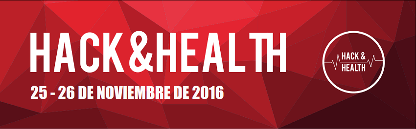

# Hack&Health App
## Authors: Ernest Benedito, Gonzalo Espinosa & Sandra Orozco

On the 25th and 26th of November of 2016 a Hackathon took place in the campus of the UPC in Terrassa. It was organized by the [City Hall of Terrassa](http://www.terrassa.cat/es/hack-health) with the collaboration of [Synergic Partners](http://www.synergicpartners.com/en/hackhealth-el-ayuntamiento-de-terrassa-organiza-el-primer-hackathon-de-big-data-y-salud-con-la-colaboracion-de-synergic-partners/), a Big Data and Data Science consulting firm, part of the Telefónica group.

The aim of the Hackathon was to find a solution to improve the quality of life of the citizens. Several data was provided from hospitals from the city and applications that focus on health such as HealthApp.

## Solution

The solution proposed by the MESIO group, formed by Ernest Benedito, Gonzalo Espinosa and Sandra Orozco was to develop an app which helped therapists that had patients with eating disorders. These kind of patients need to have a close follow-up, as they are prone to having critical episodes. Thus, with the data provided, they built an app that helped the therapist  with the following tools:

1. A quick view of the patient's performance in therms of eating frequency and activity recording.
2. A prediction with the percentage of probability of a patient to have an episode for a given day.

Below you can find further explanation about the predicting model and the app development, although you can also take a look at the [presentation](HackHealthApp_Presentation.pdf) that was done for presenting the project to the jury of the competition.

### Predicting Model

- The initial data was from **30 patients** with eating disorders, taking three times a day during 3 months. The starting point was to make an **exploratory analysis** in order to get to know the variables and their behaviour.
- **New variables** were created with, for a given moment, the **information about the last 5 days** of every patient. An **output variable** was also created, saying whether or not a patient had an **episode the next day** or not.
- A **partition** of the dataset was done, with **80 % train** and **20 % test**.
- Next step was to **choose the relevant variables**, this was done throud **Panel Linear Model** and a **stepwise** method.
- **K - Nearest Neighbours** (KNN) was choosen as the **predicting model**.
- **Tunning** of the parameters was made, reaching to an optimum at **K = 15**.

### App Development

An interactive app was developed for the therapist to have control of the patients. The prototype was made using `R` with the package `shiny`. The main tools of the application are:

- Probability of a patient to have an episode for a given day.
- The effects of the activities and the meals to the emotions of the patients.

This way the therapist could see which patients had more probabilities to have an episode and propose them certain activities or diets so to prevent them.

